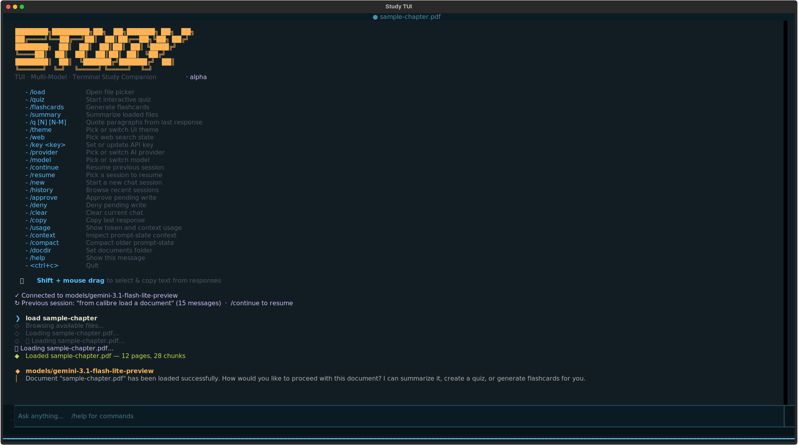
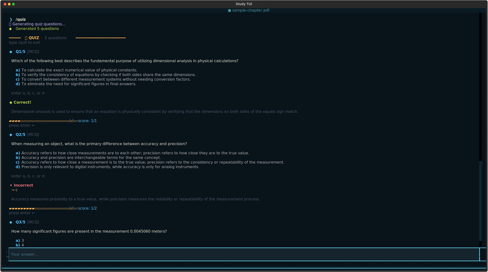
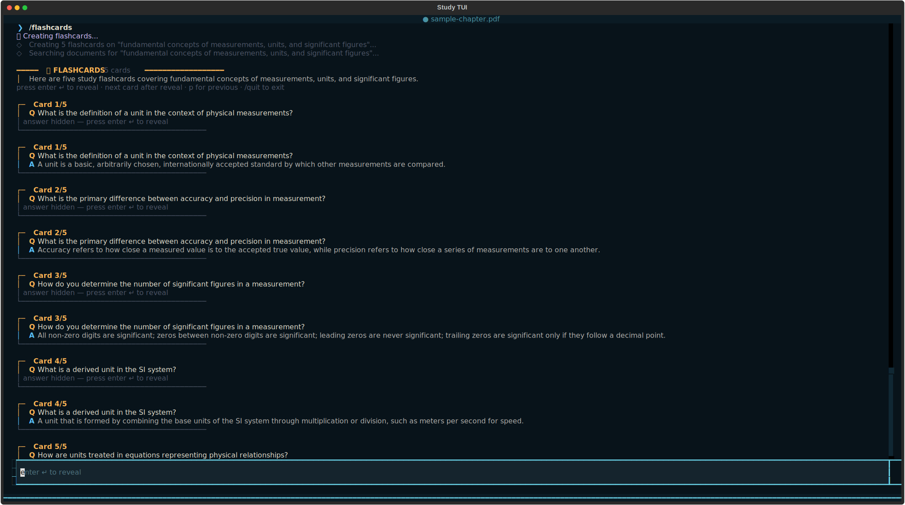

# Study TUI

Open-source AI study cockpit for your terminal. Load PDFs and images, chat over them with any LLM, quiz yourself, generate flashcards, take notes, and export — all without leaving the keyboard.


Quick links: [Features](#features) · [Install](#install) · [First Run](#first-run) · [Commands](#commands) · [Providers](#providers) · [Themes](#themes) · [Library Integrations](#library-integrations) · [Architecture](#architecture)

<p align="center">
  
</p>

<details>
<summary><strong>📝 Quiz Mode</strong> — AI-generated MCQs graded in real time</summary>
<p align="center">
  
</p>
</details>

<details>
<summary><strong>🗂 Flashcards</strong> — Q/A decks with reveal-on-enter flow</summary>
<p align="center">
  
</p>
</details>

---

## Features

### 📄 Document Intelligence
- **PDF & image loading** — parse multi-page PDFs and images (OCR via EasyOCR)
- **Figure-aware reading** — automatically detects pages with diagrams, charts, and figures; renders them as images for the model to analyze
- **BM25 search** — fast in-memory search across all loaded document chunks
- **Multi-document sessions** — load multiple files and cross-reference between them
- **Document status bar** — persistent header indicator showing currently loaded documents

### 🎓 Study Tools
- **Interactive quizzes** — multiple choice, short answer, and numeric questions generated from your material with AI-graded numeric answers
- **Flashcards** — generate Q/A decks from any chapter or topic, review inline
- **Summaries** — comprehensive document or section summaries
- **Notes** — SQLite-backed persistent notes linked to documents, pages, and tags
- **Pomodoro timer** — built-in focus timer with break management

### 📤 Export
- **Flashcards** → Markdown, CSV, or **Anki .apkg** packages
- **Notes** → Markdown or PDF
- **Summaries** → Markdown
- **Chat transcripts** → Markdown
- All writes require explicit user approval before touching disk

### 🤖 Agent System
- **Tool-calling agents** — the model searches, reads, and retrieves from your documents autonomously
- **Sub-agent spawning** — complex questions are parallelized across multiple independent research agents
- **Cascading document search** — when loading files, the agent searches local folder → Calibre → Zotero automatically

### 📚 Library Integrations
- **Calibre** — searches your local Calibre library's `metadata.db` directly (zero dependencies)
- **Zotero** — connects to Zotero's local API via `pyzotero` for reference paper access
- Smart routing: "load X" tries local → Calibre → Zotero; "load X from calibre" goes direct

### 🔍 Web Search
- **DuckDuckGo integration** — supplement documents with web research when enabled
- Toggle with `/web on` and `/web off`

### 🧠 Context Engine
- **Automatic context compaction** — long conversations are intelligently compressed to stay within model limits
- **Memory blocks** — compacted conversation history preserved across session boundaries
- **Token tracking** — real-time visibility into prompt/completion token usage

### 🔐 Provider Flexibility
- **9 providers** supported out of the box
- **3 local** (Ollama, llama.cpp, LM Studio) for privacy-first workflows
- **6 remote** (OpenAI, Anthropic, Gemini, Groq, Kimi, OpenAI Codex via ChatGPT OAuth) for maximum capability
- Secure API key storage via system keyring
- Hot-swap providers and models mid-session

### 🎨 Themes
Six built-in terminal themes:
- **Midnight** — deep dark blue (default)
- **Cyber** — green-on-black hacker aesthetic
- **Focus** — Tokyo Night-inspired muted palette
- **Retro** — warm Gruvbox earth tones
- **Aurora** — cool polar glow
- **Paper** — light cream for daytime reading

---

## Install

### Recommended: uv

```bash
# Install uv (if you don't have it)
curl -LsSf https://astral.sh/uv/install.sh | sh   # Linux/macOS
# or: winget install astral-sh.uv                  # Windows

# Clone and install
git clone https://github.com/arthalabs-in/study
cd study
uv sync              # installs all deps into an isolated venv
uv run study-tui     # launch
```

With optional extras:

```bash
uv sync --extra anki   # adds Anki .apkg export support
uv sync --extra zotero # adds Zotero integration
uv sync --extra dev    # adds pytest + coverage
```

> **Once on PyPI** you'll be able to do `uv tool install study-tui` globally, or run without installing via `uvx study-tui`.

### Alternative: pip

```bash
git clone https://github.com/arthalabs-in/study
cd study
pip install -e .
pip install pyzotero          # optional: Zotero integration
pip install -e ".[anki]"      # optional: Anki export
```

### Run

```bash
study                         # launch via short entrypoint
study-tui                     # launch
study provider                # list providers
study model list              # list models for current provider
study status                  # show current setup summary
study doctor                  # diagnose auth + runtime + deps
study setup                   # run the interactive setup wizard
study-tui path/to/notes.pdf   # open a document immediately
study-tui --setup             # run the interactive setup wizard first
```

---

## First Run

### `--setup` wizard (recommended for new users)

```bash
uv run study setup
```

Walks you through picking a provider, setting auth, choosing a model, selecting the default documents folder, configuring Calibre, enabling the Zotero webhook, and checking Manim / TeX animation readiness. Settings are saved to `~/.study-tui/settings.json`, secrets go to `~/.study-tui/secrets.json`, and `study --setup` still launches the app automatically afterwards.

API-key providers supported in the setup wizard:
- `openai` via `OPENAI_API_KEY`
- `anthropic` via `ANTHROPIC_API_KEY`
- `gemini` via `GEMINI_API_KEY`
- `groq` via `GROQ_API_KEY`
- `kimi` via `KIMI_API_KEY`

### Option A: Local model (private, free)

```bash
ollama run llama3.2            # start a model
study-tui                      # launch
/provider ollama               # switch provider inside the app
```

### Option B: API provider (fastest setup)

```text
/key openai:sk-...             # set your API key
/provider openai               # activate the provider
```

Groq works the same way:

```text
/key groq:gsk_...              # set your Groq API key
/provider groq                 # activate Groq
```

### Option C: ChatGPT OAuth (Codex)

```text
/provider openai-codex         # uses ChatGPT OAuth, no API key needed
```

---

## CLI Commands

Study TUI also supports a small non-interactive CLI for setup and diagnostics:

```bash
study provider
study provider groq
study model list
study model list groq
study model use groq:llama-3.3-70b-versatile
study status
study doctor
study setup
```

- `study provider` lists providers and auth status
- `study provider <name>` switches the default provider and resets the model to that provider's default
- `study model list [provider]` lists models for the current or requested provider
- `study model use <provider:model>` saves the default provider/model pair
- `study status` shows the current configured provider, model, folders, auth mode, and animation readiness
- `study doctor` diagnoses config, auth, Python runtime, and key dependencies like Manim, LaTeX, and `dvisvgm`
- `study setup` is the same interactive wizard as `study --setup`

---

## Commands

### Document Management
| Command | Description |
|---------|-------------|
| `/load` | Open file picker to load a PDF or image |
| `/load <path>` | Load a specific file by path |
| `/docs` | List all currently loaded documents |
| `/page <n> [doc_id]` | View a specific page |
| `/docdir [path]` | Show or set the documents folder |

### Study Actions
| Command | Description |
|---------|-------------|
| `/quiz` | Start an interactive quiz from loaded material |
| `/flashcards` | Generate flashcard deck |
| `/summary` | Generate document summary |

### Library Integration
| Command | Description |
|---------|-------------|
| `/calibre-dir <path>` | Set Calibre library location |
| `/zotero-webhook [on\|off]` | Start or stop the localhost Zotero webhook |
| `load X from calibre` | Agent searches Calibre directly |
| `load X from zotero` | Agent searches Zotero directly |

### Session Management
| Command | Description |
|---------|-------------|
| `/new` | Start a fresh chat session |
| `/clear` | Clear current chat |
| `/history` | Browse and resume previous sessions |
| `/resume <n>` | Resume a specific session |
| `/continue` | Continue the previous session |
| `/compact` | Manually compact conversation context |

### Configuration
| Command | Description |
|---------|-------------|
| `/provider [name]` | Show or switch AI provider |
| `/model [name]` | Show or switch model |
| `/key [provider:key]` | Show or set API keys |
| `/theme [name]` | Show or switch theme |
| `/web on\|off` | Toggle web search |

### Utilities
| Command | Description |
|---------|-------------|
| `/copy` | Copy last response to clipboard |
| `/q [N-M]` | Quote paragraphs from last response |
| `/usage` | Show token usage and context stats |
| `/context` | Inspect prompt-state context breakdown |
| `/approve` / `/deny` | Resolve pending write approvals |
| `/help` | Show help |
| `Ctrl+C` | Quit |

> You don't need to use slash commands for study actions — just say "quiz me on chapter 3" or "make flashcards about thermodynamics" and the agent handles it.

---

## Providers

| Provider | Type | Auth | Command |
|----------|------|------|---------|
| Kimi K2.5 | API | API key | `/provider kimi` |
| Anthropic (Claude) | API | API key | `/provider anthropic` |
| OpenAI API | API | API key | `/provider openai` |
| Groq | API | API key | `/provider groq` |
| OpenAI Codex | API | ChatGPT OAuth | `/provider openai-codex` |
| Google Gemini | API | API key | `/provider gemini` |
| Ollama | Local | None | `/provider ollama` |
| llama.cpp | Local | None | `/provider llamacpp` |
| LM Studio | Local | None | `/provider lmstudio` |

---

## Themes

Switch themes live with `/theme <name>`:

```
midnight   — Deep dark blue (default)
cyber      — Green-on-black terminal
focus      — Muted Tokyo Night palette
retro      — Warm Gruvbox earth tones
aurora     — Cool polar glow
paper      — Light cream for daytime
```

---

## Library Integrations

### Calibre

Study TUI reads your Calibre library's `metadata.db` directly — no Calibre process needed.

```text
/calibre-dir "C:\Users\You\Calibre Library"
```

Then just say "load Feynman Lectures" and the agent finds it in Calibre automatically.

### Zotero

Requires Zotero running with local API enabled:

1. Open Zotero → Settings → Advanced
2. Check "Allow other applications on this computer to communicate with Zotero"
3. Say "load attention is all you need from zotero"

Uses `pyzotero` (`pip install pyzotero`).

If you need webhook-driven updates, Study TUI exposes a localhost-only webhook with a random secret path:

```text
/zotero-webhook on
```

The app prints the callback URL after startup. It binds only to `127.0.0.1` and is disabled by default.

---

## Architecture

```
src/
├── app.py                  # Main orchestration, slash commands, session management
├── calibre_client.py       # Calibre SQLite reader
├── zotero_client.py        # Zotero local API client
├── context_engine.py       # Context compaction and memory
├── chat_history.py         # SQLite session persistence
├── notes.py                # SQLite notes storage
├── exporter.py             # Markdown, CSV, PDF, Anki export
├── web_search.py           # DuckDuckGo search
├── pomodoro.py             # Focus timer
├── theme.tcss              # Theme CSS for all 6 themes
├── agents/
│   ├── provider.py         # Multi-provider LLM abstraction
│   ├── model_client.py     # Streaming + tool-call wrapper
│   ├── agent_manager.py    # Tool execution router
│   └── tools.py            # Tool schemas for LLM function calling
├── parsers/
│   ├── pdf_parser.py       # PDF parsing, chunking, figure detection
│   ├── image_parser.py     # Image OCR pipeline
│   └── doc_store.py        # In-memory document index + BM25 search
└── widgets/
    └── chat.py             # Chat rendering, quiz UI, flashcard viewer
```

### Data Paths

| What | Where |
|------|-------|
| Settings | `~/.study-tui/settings.json` |
| Chat history | `~/.study-tui/history.db` |
| Notes | `~/.study-tui/notes.db` |
| Rendered pages | `~/.study-tui/images/` |
| Exports | `~/Documents/StudyTUI-Exports/` |

---

## Platform Notes

- **Runs on Windows, Linux, and macOS** — all core features are fully cross-platform
- The GUI file picker uses PowerShell on Windows; Linux/macOS users can load files with `/load <path>` directly
- Clipboard copy (`/copy`) uses `clip.exe` on Windows; on other platforms the response is printed for manual copy
- OCR via EasyOCR — first use downloads model weights (~100 MB)

---

## Contributing

Contributing guidelines and license file coming soon.
