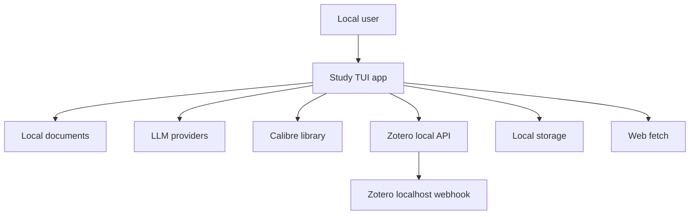

# Threat Model: crimson-voyager

## Executive summary
Study TUI is a single-user desktop TUI that ingests local PDFs and images, stores notes/history locally, and can send document-derived content to remote LLM providers for chat, summaries, flashcards, quizzes, notes, and exports. The highest-risk themes are confidentiality loss across the local-to-remote model boundary, abuse of local parsing and file-loading surfaces, and local attack paths against the new Zotero webhook and local-library integrations. The most security-sensitive code paths are the provider/tool orchestration in `src/app.py` and `src/agents/*`, document parsing in `src/parsers/*`, local persistence in `src/chat_history.py` and `src/notes.py`, and the new Zotero localhost surfaces in `src/zotero_client.py` and `src/zotero_webhook.py`.

## Scope and assumptions
- In scope:
  - `src/app.py`
  - `src/agents/`
  - `src/parsers/`
  - `src/chat_history.py`
  - `src/notes.py`
  - `src/exporter.py`
  - `src/web_search.py`
  - `src/secure_storage.py`
  - `src/calibre_client.py`
  - `src/zotero_client.py`
  - `src/zotero_webhook.py`
  - `pyproject.toml`
  - `README.md`
- Out of scope:
  - CI/release pipeline details
  - test-only code except where it evidences intended runtime behavior
  - bundled fixture/audit artifacts under `src/security_audit_artifacts/`
- Validated assumptions:
  - The app is intended for single-user/personal use, not multi-user hosting.
  - The Zotero webhook is expected to remain localhost-only.
  - Loaded documents and notes should be treated as personal material by default.
  - Users may choose remote providers, so sending personal content off-host is a supported runtime path.
- Open questions that would materially change ranking:
  - Whether users are expected to tunnel or expose the Zotero webhook externally in practice.
  - Whether future integrations will add remote sync/storage beyond the current local-library pattern.

## System model
### Primary components
- Textual desktop/TUI host in [src/app.py](src/app.py) orchestrates providers, slash commands, approvals, session state, and file loading.
- Provider abstraction in [src/agents/provider.py](src/agents/provider.py) sends prompt state and tool traffic to remote or local LLM endpoints.
- Tool router in [src/agents/agent_manager.py](src/agents/agent_manager.py) mediates model access to documents, notes, exports, web search, Calibre, and Zotero.
- Local document ingestion/parsing in [src/parsers/pdf_parser.py](src/parsers/pdf_parser.py), [src/parsers/image_parser.py](src/parsers/image_parser.py), and [src/parsers/doc_store.py](src/parsers/doc_store.py).
- Local persistence in [src/chat_history.py](src/chat_history.py), [src/notes.py](src/notes.py), and [src/secure_storage.py](src/secure_storage.py).
- Local integrations:
  - Calibre library access in [src/calibre_client.py](src/calibre_client.py)
  - Zotero local API access in [src/zotero_client.py](src/zotero_client.py)
  - Zotero localhost webhook listener in [src/zotero_webhook.py](src/zotero_webhook.py)
- Optional outbound web fetch in [src/web_search.py](src/web_search.py).

### Data flows and trust boundaries
- User -> Study TUI app
  - Data: prompts, slash commands, file-picker selections, settings, note/export approvals.
  - Channel: terminal UI and local process calls.
  - Security guarantees: single local user context; write actions gated by approval for `save_note`/`export_content` in `src/agents/agent_manager.py`.
  - Validation: command parsing in `src/app.py`; picker/path validation for document directory and load paths.
- Study TUI app -> local document files
  - Data: PDFs/images selected by user or model-mediated autoload.
  - Channel: local filesystem reads.
  - Security guarantees: model-triggered loads are rooted to configured `documents_dir` and reject absolute/UNC/escaping paths in `src/agents/agent_manager.py::_resolve_documents_file`.
  - Validation: suffix/type checks, path normalization, parser size/resource limits.
- Study TUI app -> remote LLM provider
  - Data: system prompt, compacted conversation history, document excerpts, tool results, user notes/questions.
  - Channel: HTTPS APIs or local OpenAI-compatible endpoints, configured in `src/agents/provider.py`.
  - Security guarantees: provider auth depends on per-provider API keys/OAuth; no content redaction layer before sending.
  - Validation: prompt assembly and compaction reduce bloat but not sensitivity.
- Study TUI app -> local Calibre/Zotero services/data
  - Data: search terms, item keys, local metadata, local PDF paths.
  - Channel: local SQLite access for Calibre; `http://127.0.0.1:23119` and local storage paths for Zotero.
  - Security guarantees: localhost trust boundary only; item-key validation added in `src/zotero_client.py` and `src/agents/agent_manager.py`.
  - Validation: bounded string trimming and item-key regex.
- Zotero local process -> Study TUI Zotero webhook
  - Data: local webhook event JSON.
  - Channel: HTTP POST to `127.0.0.1:<port>/zotero/webhook/<secret>` in `src/zotero_webhook.py`.
  - Security guarantees: localhost-only bind, random secret path, POST-only, JSON-only, body size cap.
  - Validation: exact path match, `Content-Length` upper bound, JSON parse.
- Study TUI app -> export/history/notes storage
  - Data: chat history, saved notes, exported markdown/csv/pdf/apkg artifacts, settings, webhook secret.
  - Channel: local filesystem and SQLite.
  - Security guarantees: Windows DPAPI for protected text in `src/secure_storage.py`; plaintext fallback on non-Windows.
  - Validation: approval gate for writes, but export destinations are intentionally user-readable.
- Study TUI app -> web content
  - Data: search query, fetched result text.
  - Channel: DuckDuckGo search package plus direct HTTPS fetches in `src/web_search.py`.
  - Security guarantees: HTTPS-only fetches, no redirects, public-IP hostname check.
  - Validation: scheme/host validation and response content-type/size bounds.

#### Diagram

## Assets and security objectives
| Asset | Why it matters | Security objective (C/I/A) |
|---|---|---|
| Loaded PDFs/images and parsed chunks | Personal study material may include research papers, notes, or private documents | C, I |
| Notes/chat history | Contains derived study notes, prompts, and potentially sensitive excerpts | C, I |
| Exported artifacts (`md`, `csv`, `pdf`, `apkg`) | Readable files can leak personal material outside the app | C, I |
| Provider credentials and OAuth state | Theft enables API abuse or account-backed model access | C |
| Zotero webhook secret and settings | Lets a local actor inject fake webhook events if obtained | I |
| Calibre/Zotero local library paths and metadata | Exposes local research catalog and attachment locations | C |
| Document parsing/runtime availability | Large/malformed files can degrade or block the local app | A |
| Context/model history | Can carry old private material into future provider calls | C |

## Attacker model
### Capabilities
- A malicious or curious local process/user on the same machine can access localhost services, user files, and exported artifacts.
- A malicious document or web page can supply untrusted text to the model and tool loop.
- A remote web host can influence fetched content returned by web search, subject to `src/web_search.py` safety checks.
- A remote LLM provider receives any prompt/tool content that the user chooses to process through that provider.

### Non-capabilities
- No internet-exposed web server is in scope by default.
- No multi-user tenant boundary exists in the validated usage model.
- The Zotero webhook is not assumed to be reverse-proxied or public.
- There is no direct model-driven shell execution surface in the inspected runtime code.

## Entry points and attack surfaces
| Surface | How reached | Trust boundary | Notes | Evidence (repo path / symbol) |
|---|---|---|---|---|
| Chat input / slash commands | Local user in terminal | User -> app | Controls study actions, exports, settings, approvals | `src/app.py::_handle_slash_command`, `src/widgets/chat.py` |
| Native file picker and direct `/load` | Local user | User -> local files | Reads arbitrary user-selected PDFs/images | `src/app.py::_pick_and_load_file`, `src/app.py::_load_file` |
| Model-triggered autoload | LLM tool call | Model -> local files | Rooted to configured docs dir; rejects absolute/UNC/escaping paths | `src/agents/agent_manager.py::_resolve_documents_file` |
| PDF/image parsers | Local file ingestion | Local files -> parser | Complex document/OCR surface; historically DoS-prone class | `src/parsers/pdf_parser.py`, `src/parsers/image_parser.py` |
| Remote provider APIs | Model chat/tool loop | App -> remote provider | Sends prompts, chunks, notes, summaries, etc. | `src/agents/provider.py`, `src/app.py` |
| Web search and page fetch | Model/user request | App -> internet | HTTPS-only, no redirects, public-host checks | `src/web_search.py` |
| Calibre integration | Tool call or slash-configured path | App -> local Calibre DB/files | Direct local SQLite and PDF path resolution | `src/calibre_client.py`, `src/agents/agent_manager.py` |
| Zotero local API | Tool call | App -> localhost Zotero | Reads local library metadata/attachments | `src/zotero_client.py` |
| Zotero webhook listener | `/zotero-webhook on` | Localhost client -> app | New network listener on localhost with secret path | `src/zotero_webhook.py`, `src/app.py` |
| Notes/history/export persistence | Tool call and app session logic | App -> local storage | Sensitive at-rest and plaintext export surface | `src/notes.py`, `src/chat_history.py`, `src/exporter.py`, `src/secure_storage.py` |

## Top abuse paths
1. Attacker goal: exfiltrate personal study material through a remote provider.
   1. User loads personal documents and uses a remote provider.
   2. App sends grounded chunks, summaries, or note/export context to the provider.
   3. Remote provider or account compromise exposes private content.

2. Attacker goal: inject fake Zotero webhook events on the same machine.
   1. Local attacker learns the callback URL from UI output or settings.
   2. Attacker POSTs arbitrary JSON to the secret-path webhook.
   3. App accepts and surfaces the event as trusted local library activity.

3. Attacker goal: abuse large/malformed documents for availability loss.
   1. User or model loads a crafted PDF/image.
   2. Parser/OCR work consumes excessive CPU, memory, or storage.
   3. The app becomes slow, unstable, or unavailable.

4. Attacker goal: harvest readable exports or plaintext local storage.
   1. Sensitive notes/flashcards/history are saved/exported.
   2. Another local process/user reads `StudyTUI-Exports`, settings, or plaintext-at-rest DB content on non-Windows.
   3. Private study/research content is exposed.

5. Attacker goal: leverage tool-mediated local-library access to enumerate private research material.
   1. User prompts the model naturally.
   2. Model uses `calibre_search`/`zotero_search` and returns titles/authors/tags.
   3. Private library metadata becomes part of visible transcript or remote provider context.

6. Attacker goal: poison future context with oversized tool results.
   1. User runs repeated search/flashcard/summary actions on large documents.
   2. Tool results are compacted but still retained in model history.
   3. Old sensitive material continues to ride along in later provider calls.

7. Attacker goal: coerce the model into writing to disk.
   1. Malicious document/web text instructs the model to save/export.
   2. App requests approval for `save_note` or `export_content`.
   3. User mistakenly approves a persistence action containing sensitive or misleading content.

## Threat model table
| Threat ID | Threat source | Prerequisites | Threat action | Impact | Impacted assets | Existing controls (evidence) | Gaps | Recommended mitigations | Detection ideas | Likelihood | Impact severity | Priority |
|---|---|---|---|---|---|---|---|---|---|---|---|---|
| TM-001 | Remote provider operator / provider compromise | User selects a remote provider and loads personal material | Sensitive document chunks, summaries, notes, or quiz/flashcard context are sent to remote APIs | Confidentiality loss of personal documents and derived notes | Loaded docs, notes, model history | Provider choice is explicit; context compaction exists; no silent disk writes without approval (`src/app.py`, `src/context_engine.py`) | No content-classification or redaction layer before provider calls; remote path is normal by design | Add a privacy mode that blocks remote providers for loaded docs, add explicit per-session “remote provider will see document content” banners, and optionally redact note/history replay for sensitive sessions | Log provider choice, large prompt-state sends, and whether grounded doc content was included | High | High | high |
| TM-002 | Local attacker/process on same machine | Webhook enabled and secret disclosed from UI/settings or same-user file access | POST forged JSON to the localhost Zotero webhook and influence app state/UX | Integrity loss, misleading library events, possible social engineering | Webhook secret, user trust in library events | Localhost bind only, random secret path, POST-only, body cap, JSON-only (`src/zotero_webhook.py`) | No source authentication beyond path secret; no replay protection; secret printed in UI and stored in settings | Add optional HMAC/header verification if Zotero supports it, add nonce/timestamp replay checks, and avoid printing full callback URL after initial setup | Log event timestamps and local source address if available; alert on bursty or malformed webhook traffic | Medium | Medium | medium |
| TM-003 | Malicious document / accidental heavy file | User or model loads crafted/huge PDFs/images | Trigger expensive parsing/OCR/rendering and degrade the app | Availability loss; possible temp/storage pressure | Parser runtime, local availability | Size/resource hardening was previously added in parsers; file type/path restrictions exist (`src/parsers/pdf_parser.py`, `src/parsers/image_parser.py`, `src/agents/agent_manager.py`) | Parsing remains a rich attack surface; no isolation boundary around parser/OCR | Keep hard size/page caps strict, consider parser subprocess isolation for OCR/rendering, and surface clearer load refusal messages | Track parse failures, duration, and repeated load crashes | Medium | Medium | medium |
| TM-004 | Local attacker/process or shared-machine scenario | Exports/notes/history exist on disk | Read plaintext exports or non-Windows plaintext-at-rest content | Confidentiality loss of personal notes, chats, and flashcards | Exports, notes DB, history DB, settings | Windows DPAPI protects some stored text (`src/secure_storage.py`); exports require explicit user action (`src/agents/agent_manager.py`) | Exports are intentionally readable; non-Windows falls back to plaintext; webhook secret is stored in settings | Add optional encrypted export destination, broader at-rest encryption on non-Windows, and clearer warnings when exporting sensitive content | Periodic “recent exports” view and audit messages when sensitive note/chat exports are created | Medium | High | high |
| TM-005 | Model misuse / prompt injection from docs or web content | User loads malicious content and approves write actions carelessly | Coerce model into saving/exporting attacker-chosen content or leaking private content to disk | Integrity/confidentiality impact through persisted misleading content | Notes, exports, user trust | Approval gate for `save_note`/`export_content`; prompts treat content as untrusted (`src/app.py`, `src/agents/agent_manager.py`) | User can still approve unsafe persistence; approval prompt is metadata-focused but not full semantic review | Strengthen approval UX with source provenance and preview diff, and highlight when content originated from web search or untrusted docs | Log approval actions with tool type, source doc/web indicator, and destination | Medium | Medium | medium |
| TM-006 | Local attacker/process | Access to same user profile or settings files | Read Zotero webhook secret, provider auth state, and local-library settings from disk | Enables local spoofing and privacy loss | Webhook secret, provider/OAuth state, settings | Some auth paths use secure storage/keyring patterns; webhook is localhost only (`src/app.py`, `src/secure_storage.py`) | Settings file still contains operational secrets/paths; protection is weaker than OS keystore | Move webhook secret and any refresh tokens fully into secure storage where possible; minimize sensitive config in `settings.json` | Detect settings migration failures and report when secrets remain outside secure storage | Medium | Medium | medium |
| TM-007 | Local/remote content via search and library metadata | User asks open-ended natural-language questions | Large library metadata, search results, or old conversation context is carried into later turns/providers | Confidentiality bloat and token-cost/availability pressure | Model history, personal library metadata | Context engine separates transcript from model history and compacts artifacts (`src/context_engine.py`, `src/app.py`) | Compaction reduces size but not all sensitivity; library metadata still enters context when used | Add category-specific opt-outs so Calibre/Zotero metadata is not retained beyond the immediate answer unless needed | Expand `/context` diagnostics to show category-specific retained content | Medium | Medium | medium |

## Criticality calibration
- Critical:
  - A flaw that lets a remote attacker execute code or read arbitrary local files without user involvement.
  - A design that exposes personal documents to the internet without user intent or provider choice.
- High:
  - Loss of personal document/note confidentiality through normal supported use with insufficient warning.
  - Local or same-user compromise of sensitive exports/history that meaningfully exposes personal study material.
  - A parser/integration flaw that consistently crashes the app on realistic user inputs.
- Medium:
  - Localhost webhook spoofing requiring same-machine access.
  - Prompt-injection paths that still depend on user approval to persist content.
  - Context bloat that leaks extra metadata/content to providers or degrades availability/cost.
- Low:
  - Minor metadata leakage such as library titles without document body content.
  - Noisy local DoS that is easy to recover from by restarting the app.
  - Cosmetic or single-session integrity issues without persistence or data exposure.

## Focus paths for security review
| Path | Why it matters | Related Threat IDs |
|---|---|---|
| `src/app.py` | Main trust-boundary coordinator for providers, approvals, webhook control, settings, and session/context flow | TM-001, TM-005, TM-006, TM-007 |
| `src/agents/provider.py` | Remote/local provider boundary and tool-loop wiring that determines what personal content leaves the machine | TM-001, TM-007 |
| `src/context_engine.py` | Decides what historical/tool content is retained and resent to providers | TM-001, TM-007 |
| `src/agents/agent_manager.py` | Enforces file-load rooting, export approvals, Calibre/Zotero access, and tool result handling | TM-003, TM-004, TM-005, TM-007 |
| `src/zotero_webhook.py` | New localhost listener; principal new network-exposed runtime surface | TM-002, TM-006 |
| `src/zotero_client.py` | Localhost API and local attachment path resolution for personal reference material | TM-002, TM-007 |
| `src/calibre_client.py` | Direct local DB/file access to private library metadata and attachments | TM-004, TM-007 |
| `src/parsers/pdf_parser.py` | High-risk parser/rendering surface for malicious or oversized PDFs | TM-003 |
| `src/parsers/image_parser.py` | OCR/image parsing surface with availability and resource risks | TM-003 |
| `src/web_search.py` | Outbound web fetch boundary; relevant for SSRF-like safety and prompt-injection content intake | TM-005 |
| `src/notes.py` | Sensitive local note persistence and PDF export behavior | TM-004, TM-005 |
| `src/chat_history.py` | Persisted conversation state, including personal prompts and study-derived content | TM-004, TM-007 |
| `src/secure_storage.py` | Determines whether sensitive local content is protected at rest | TM-004, TM-006 |
| `src/exporter.py` | Produces user-readable artifacts that may leak personal material outside the app | TM-004 |

## Quality check
- All discovered runtime entry points are covered: chat/slash commands, file loads, parsers, provider APIs, web search, Calibre, Zotero API, Zotero webhook, local persistence, exports.
- Each trust boundary appears in at least one abuse path or threat row.
- Runtime behavior is separated from CI/dev/test concerns.
- User clarifications were incorporated: localhost-only webhook, single-user deployment, personal documents by default.
- Assumptions and residual open questions are explicit.

